<p align="center"></p>

# ( Wsp chatbot easy )  ლ(╹◡╹ლ)
> En desarrollo 🥲


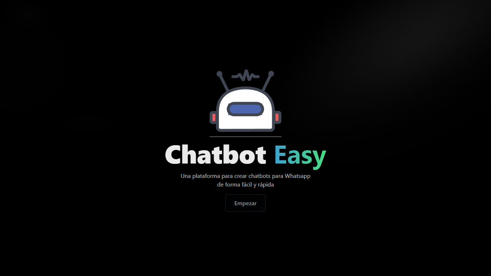

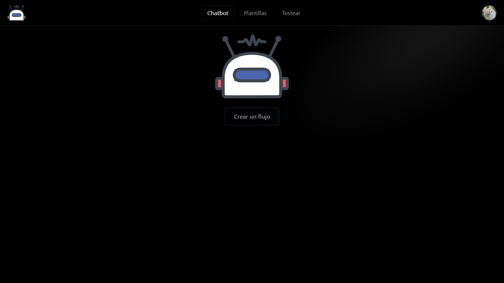

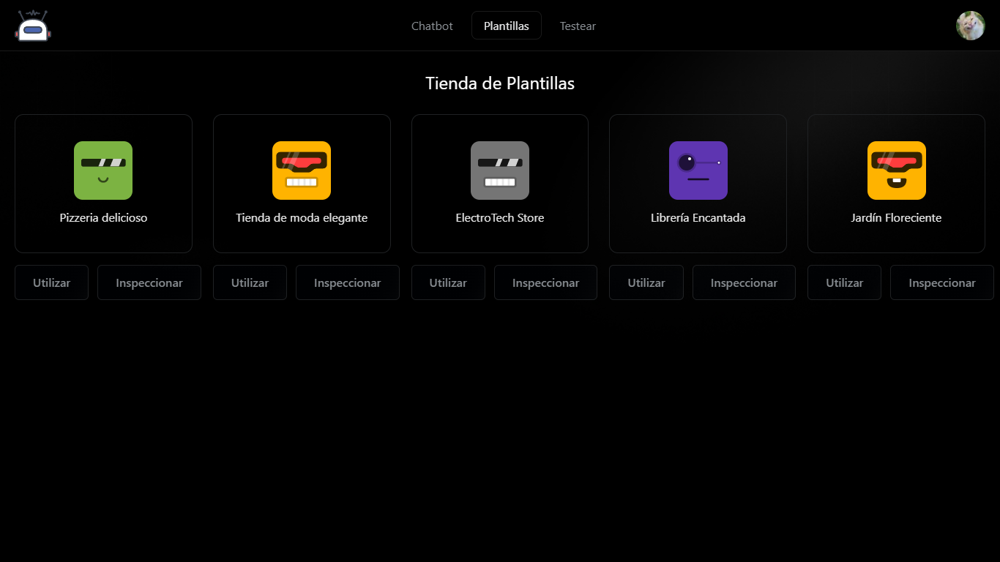

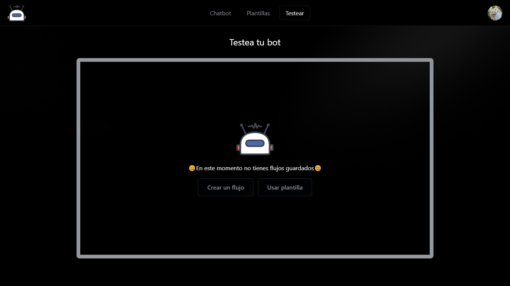

## Tabla de  contenidos

- [Tutorial de uso](#tutorial-de-uso👇)
- [Plantillas](#usar-plantillas)
- [Instalación](#instalacion)
- [Herramientas utilizadas](#herramientas-utilizadas)


## Tutorial de uso.👇

### Inicia sesión con WhatsApp
> proximamente... 🥲


### Crear Flujo de conversación

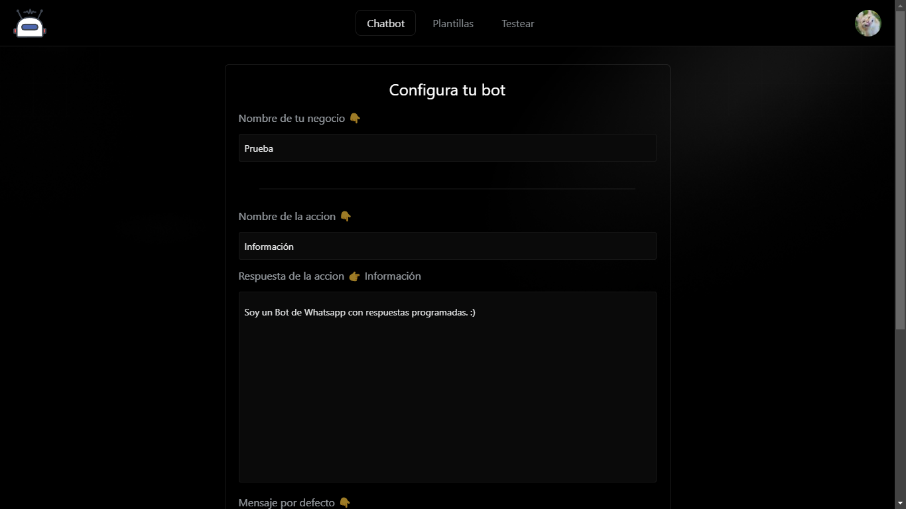

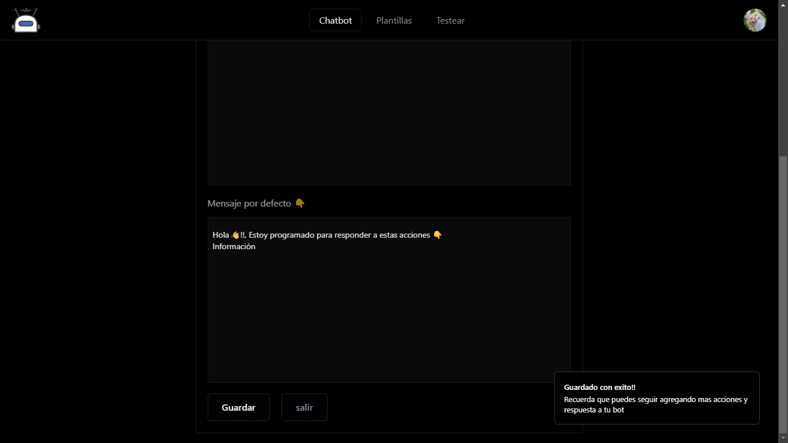

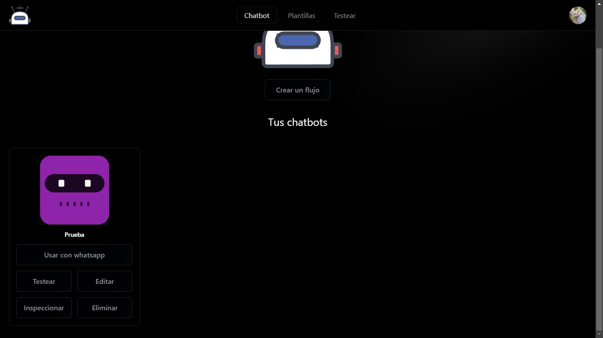

### Opciones al crear un flujo

#### **Usar con whatsapp**
> proximamente... 🥲

#### **Inspeccionar Flujo creado**

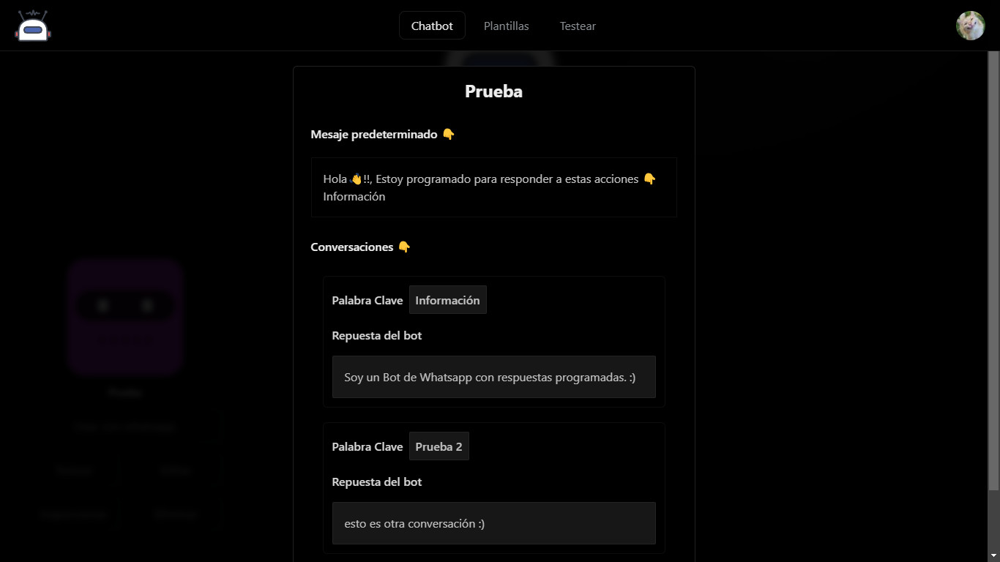


#### **Testear flujo**
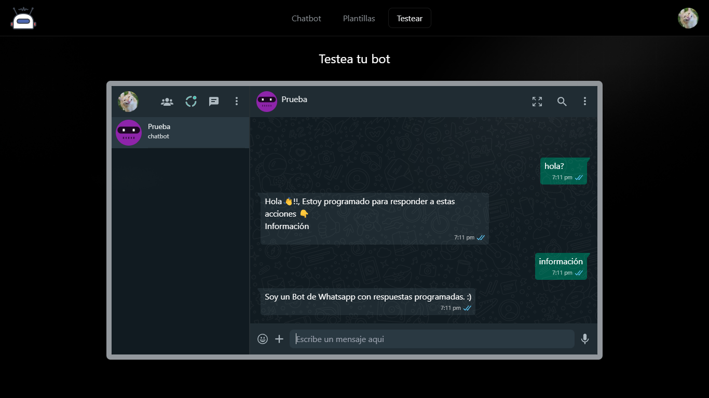

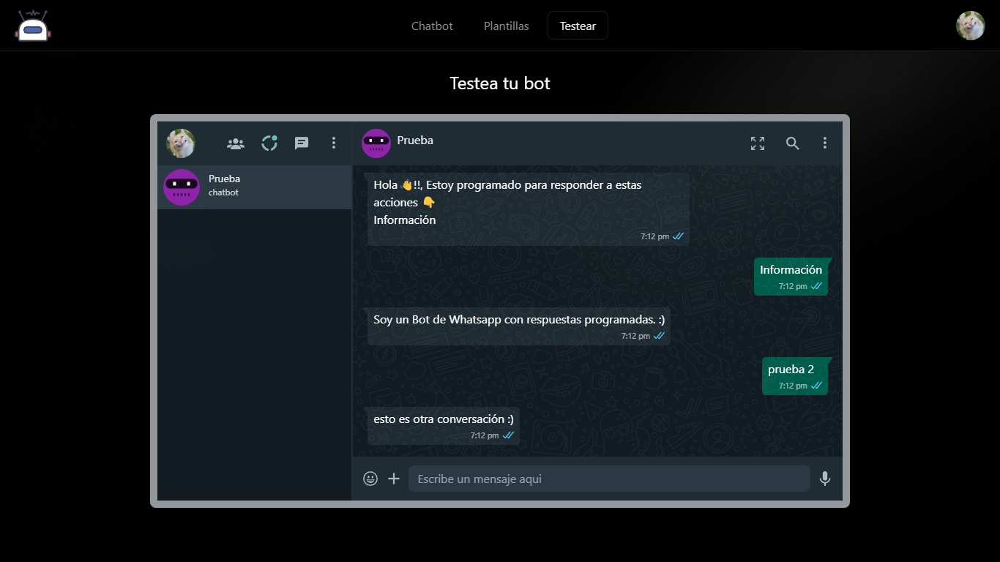

#### **Editar flujo**
##### Opciones al editar un flujo

###### **Modificar el nombre del flujo y el mensaje predeterminado**

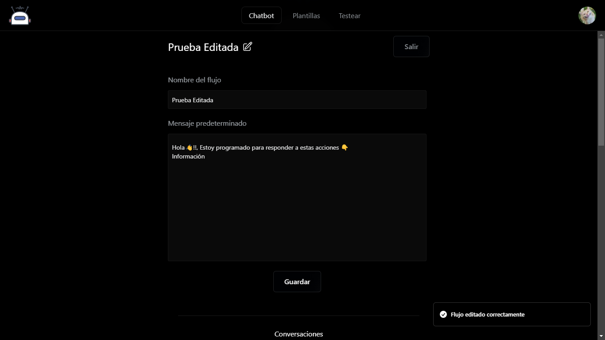

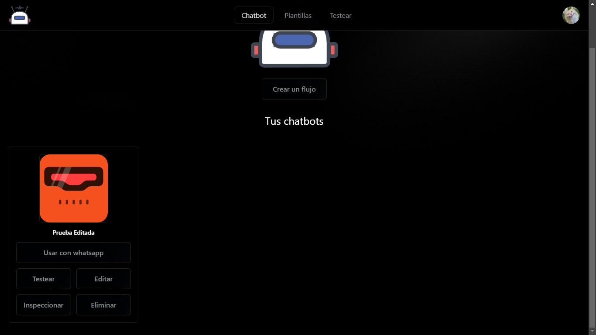

###### **Modificar la acción y la respuesta del bot**

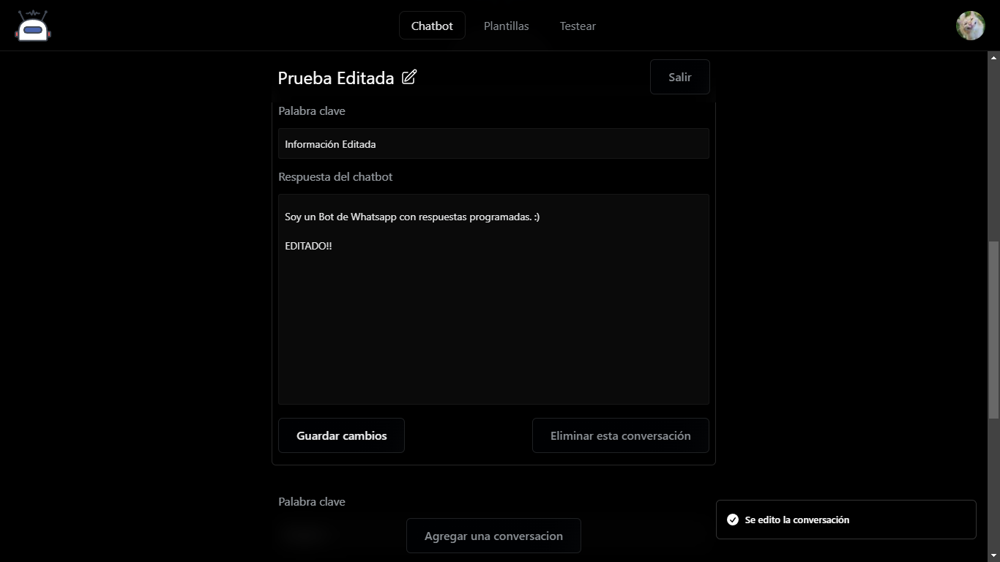

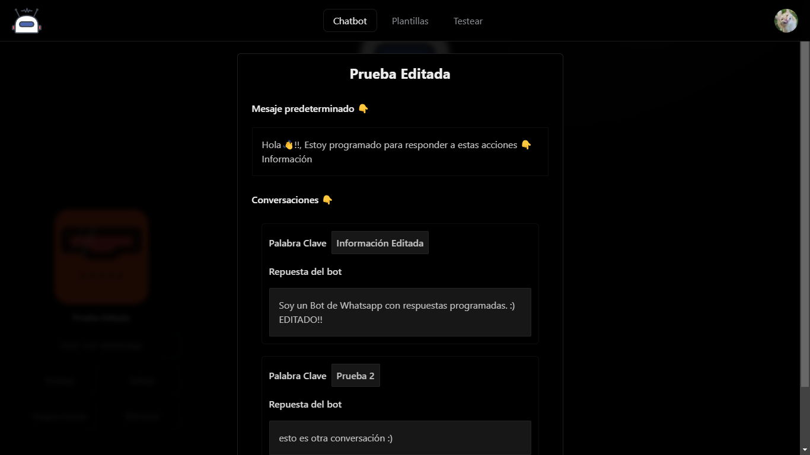

> Resultado 👇.

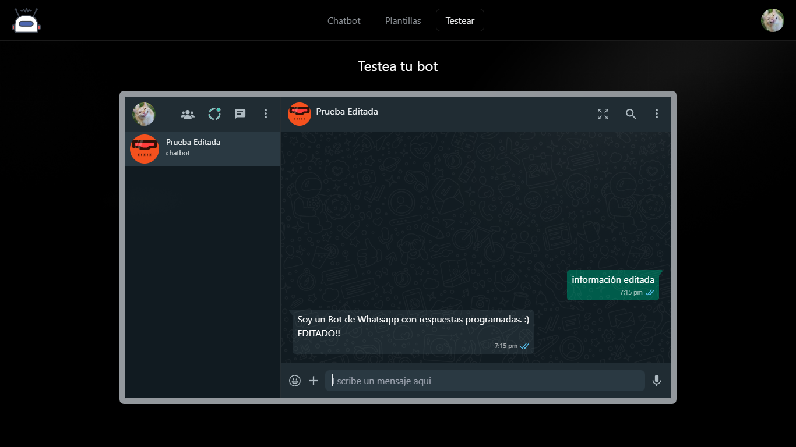

###### **Eliminar conversaciones**
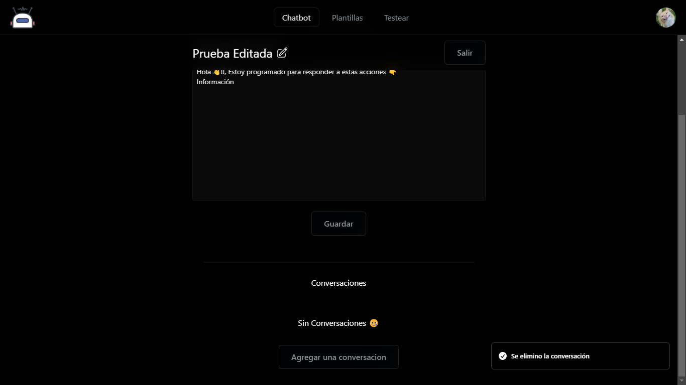

## Usar plantillas👇
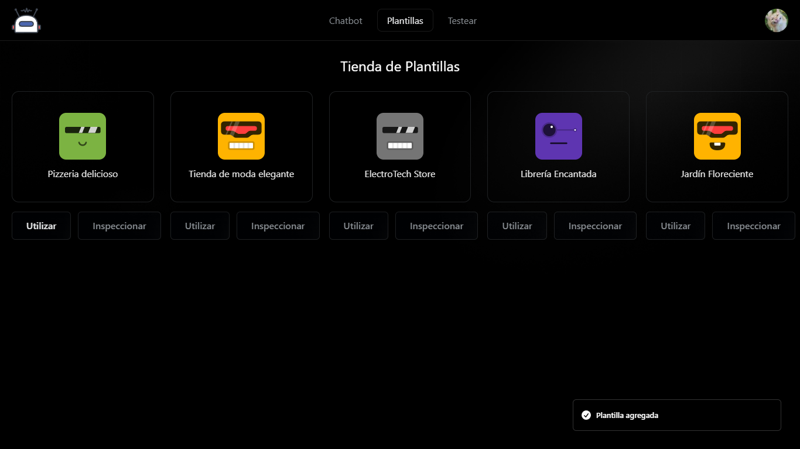

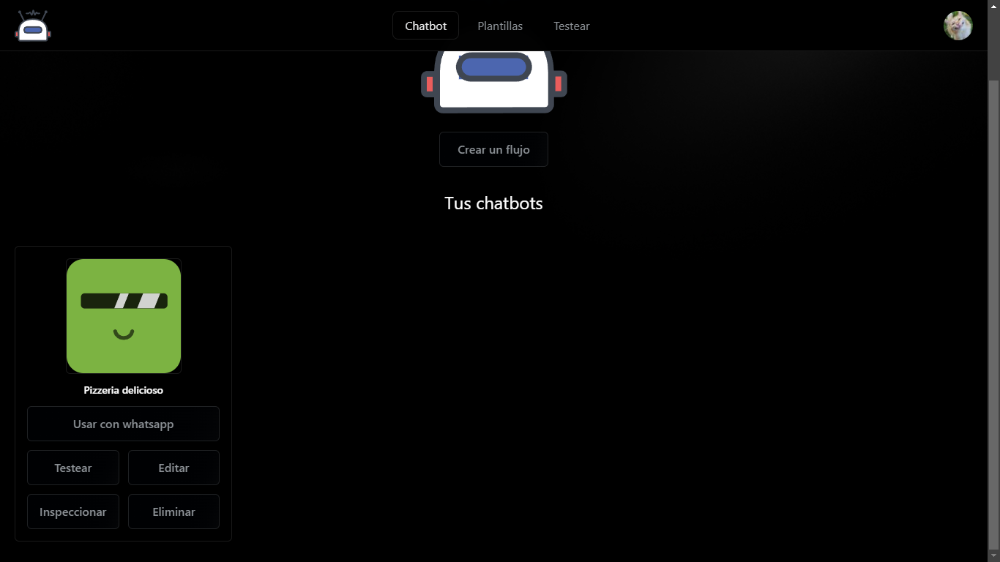

## Instalacion

### Requisitos:
* Tener instalado [Node JS → ](https://nodejs.org/es)
* Tener instalado [GIT → ](https://git-scm.com/)

### Instalacion:
* Clonar el repositorio en su maquina 👇.
```shell
git clone https://github.com/ChapST1/wsp-bot-easy.git
```
* Entrar a la carpeta clonada y abrir la terminal 👇.
```shell
 cd wsp-bot-ease
```
* Ejecutar el siguiente comando de node para instalar las dependencias que necesita el proyecto 👇.
```shell
 npm install
 ```
* Por ultimo escribes el siguiente comando para correr el proyecto 👇.
```shell
 npm run dev
 ```
* Ahora tienes que abrir tu navegador e ir a la siguiente URL 👇.
```js
 http://localhost:5173/
 ```

## Herramientas utilizadas
- [React JS → ](https://react.dev/)
- [React router dom → ](https://reactrouter.com/en/main)
- [Tailwind CSS → ](https://tailwindcss.com/)
- [Zustand → ](https://zustand-demo.pmnd.rs/)
- [Sonner → ](https://sonner.emilkowal.ski/)

